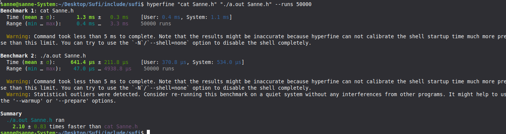

# CAT

### A faster, smaller, dependency-free `cat`.

**CAT** is a high-performance replacement for the standard Linux `cat` command—built from the ground up for **speed, simplicity, and minimal dependencies**.

Written in **Sufi** and compiled to native assembly with **Sanne Karibo**, CAT delivers up to **~2.5× faster performance** than the default Linux `cat` in our benchmarked workloads, without relying on glibc or dynamic libraries.

Developed by **Sanne Karibo** (`github.com/sanneemmanuel`) under **CS-TECHNOLOGY**, CAT is a **property of CS-TECHNOLOGY — 2026**.

> **Do more with less.**

---

## ⚡ Why CAT?

* **~2.5× faster** in benchmarked workloads
* **No glibc dependency**
* **No dynamic libraries**
* **Native Linux executable**
* **Small and lightweight**
* **Open source**
* Written in **Sufi**
* Compiled to native assembly with **Sanne Karibo**

**Simple software. Minimal overhead. Native performance.**

---

## 📊 Performance

CAT is benchmarked on worst case hardware against the default Linux `cat` using **Hyperfine**.



> Results may vary depending on hardware, filesystem, kernel, cache state, and workload.

---

## 📥 Installation

There are two ways to install CAT: **download the prebuilt binary** or **build it yourself**.

### Option 1 — Download the Binary

Download the prebuilt `cat` binary from the project's releases.

Make it executable:

```bash
chmod +x cat
```

Install it as `cat2`:

```bash
sudo cp cat /usr/local/bin/cat2
```

You can then run:

```bash
cat2 filename
```

---

### Option 2 — Build and Install with Make

CAT includes a `Makefile` for simple installation.

Make sure `cat.S` and the `Makefile` are in the same directory, then run:

```bash
sudo make
```

The Makefile will:

1. Compile `cat.S`
2. Build the native `cat2` executable
3. Set the correct executable permissions
4. Install CAT to `/usr/local/bin/cat2`

After installation:

```bash
cat2 filename
```

To verify the installation:

```bash
which cat2
```

The expected result is:

```text
/usr/local/bin/cat2
```

### Build Manually

If you prefer not to use `make`, compile the assembly directly:

```bash
gcc -nostdlib -static -o cat2 cat.S
chmod +x cat2
sudo install -m 755 cat2 /usr/local/bin/cat2
```

CAT is designed to run without glibc or dynamically linked runtime libraries.

---

## ▶️ Usage

CAT keeps the interface you already know.

```bash
cat2 filename
```

Multiple files:

```bash
cat2 file1.txt file2.txt
```

Redirect output:

```bash
cat2 file.txt > output.txt
```

Use it in a pipeline:

```bash
cat2 file.txt | grep "hello"
```

> **If you know `cat`, you already know CAT.**

---

## 🔍 Source Code

CAT is completely open source.

**Original Sufi source:**

```text
cat.sufi
```

**Generated assembly:**

```text
cat.S
```

**Build system:**

```text
Makefile
```

View the Sufi source:

```bash
less cat.sufi
```

View the generated assembly:

```bash
less cat.S
```

View the build instructions:

```bash
less Makefile
```

### From Source to Native Binary

```text
cat.sufi
   ↓
Sanne Karibo
   ↓
cat.S
   ↓
Makefile / GCC
   ↓
cat2
```

Every layer is open for inspection.

---

## 🧠 Built for Simplicity

CAT doesn't reinvent the interface. It refines the implementation.

The command stays familiar while the software underneath is stripped down to the essentials.

**Small. Native. Fast.**

---

## 🤝 Open Source

CAT is open-source software developed by **Sanne Karibo** under **CS-TECHNOLOGY** and released as a property of **CS-TECHNOLOGY**.

Contributions, optimizations, benchmarks, and improvements are welcome.

See `LICENSE` for licensing information.

---

# CAT

### The simplicity of `cat`.

### The performance of native code.

**Developed by Sanne Karibo**
**CS-TECHNOLOGY · 2026**

**© CS-TECHNOLOGY**
